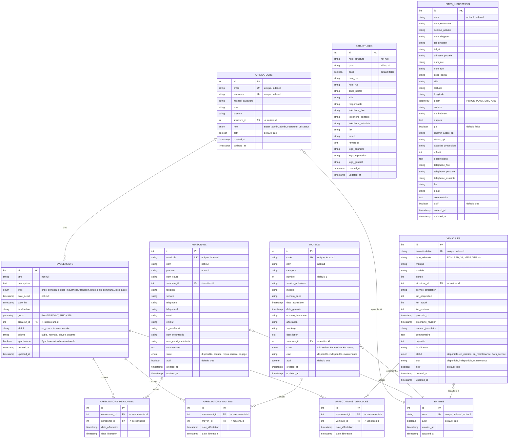

# Schéma de la Base de Données - GerMaCrise V3

## Vue d'ensemble

La base de données est conçue pour gérer une main courante informatique multi-utilisateurs avec gestion de crise, personnel, moyens, véhicules, structures et sites industriels.

## Diagramme ER (Entity-Relationship)



## Description détaillée des tables

### 1. UTILISATEURS

Table principale pour la gestion des utilisateurs de l'application.

| Colonne | Type | Contraintes | Description |
| ------- | ---- | ----------- | ----------- |
| `id` | INTEGER | PK, AUTO | Identifiant unique |
| `email` | VARCHAR | UNIQUE, NOT NULL, INDEX | Email de l'utilisateur |
| `username` | VARCHAR | UNIQUE, NOT NULL, INDEX | Nom d'utilisateur |
| `hashed_password` | VARCHAR | NOT NULL | Mot de passe hashé (bcrypt) |
| `nom` | VARCHAR | NULLABLE | Nom de famille |
| `prenom` | VARCHAR | NULLABLE | Prénom |
| `structure_id` | INTEGER | FK, NULLABLE | Référence à l'entité (-> entites.id) |
| `role` | ENUM | DEFAULT: 'utilisateur' | Rôle: super_admin, admin, operateur, utilisateur |
| `actif` | BOOLEAN | DEFAULT: true | Utilisateur actif/inactif |
| `created_at` | TIMESTAMP | AUTO | Date de création |
| `updated_at` | TIMESTAMP | AUTO | Date de mise à jour |

**Relations:**

- `evenements_crees`: Relation 1-N avec EVENEMENTS (un utilisateur peut créer plusieurs événements)
- `structure`: Relation N-1 avec ENTITES (un utilisateur appartient à une entité)

---

### 2. PERSONNEL

Table pour gérer le personnel (sapeurs-pompiers, agents, etc.).

| Colonne | Type | Contraintes | Description |
| ------- | ---- | ----------- | ----------- |
| `id` | INTEGER | PK, AUTO | Identifiant unique |
| `matricule` | VARCHAR | UNIQUE, INDEX | Matricule unique du personnel |
| `nom` | VARCHAR | NOT NULL | Nom de famille |
| `prenom` | VARCHAR | NOT NULL | Prénom |
| `nom_court` | VARCHAR | NULLABLE | Nom court (ex: J. Dupont) |
| `structure_id` | INTEGER | FK, NULLABLE | Référence à l'entité (-> entites.id) |
| `fonction` | VARCHAR | NULLABLE | Fonction (ex: Sapeur-pompier, Chef de centre) |
| `service` | VARCHAR | NULLABLE | Service d'affectation |
| `telephone` | VARCHAR | NULLABLE | Premier numéro de téléphone |
| `telephone2` | VARCHAR | NULLABLE | Deuxième numéro de téléphone |
| `email` | VARCHAR | NULLABLE | Email principal |
| `email2` | VARCHAR | NULLABLE | Email secondaire |
| `id_meshtastic` | VARCHAR | NULLABLE | Identifiant Meshtastic (ex: !a1b2c3d4) |
| `nom_meshtastic` | VARCHAR | NULLABLE | Nom Meshtastic (nom long) |
| `nom_court_meshtastic` | VARCHAR | NULLABLE | Nom court Meshtastic |
| `commentaire` | TEXT | NULLABLE | Commentaires sur le personnel |
| `statut` | ENUM | DEFAULT: 'disponible' | Statut: disponible, occupe, repos, absent, engage |
| `actif` | BOOLEAN | DEFAULT: true | Personnel actif/inactif |
| `created_at` | TIMESTAMP | AUTO | Date de création |
| `updated_at` | TIMESTAMP | AUTO | Date de mise à jour |

**Relations:**

- `affectations`: Relation 1-N avec AFFECTATIONS_PERSONNEL
- `structure`: Relation N-1 avec ENTITES (un personnel appartient à une entité)

---

### 3. MOYENS

Table pour gérer les moyens matériels et équipements.

| Colonne | Type | Contraintes | Description |
| ------- | ---- | ----------- | ----------- |
| `id` | INTEGER | PK, AUTO | Identifiant unique |
| `code` | VARCHAR | UNIQUE, INDEX | Code unique du moyen (ex: MAT-001) |
| `nom` | VARCHAR | NOT NULL | Nom du moyen |
| `categorie` | VARCHAR | NULLABLE | Catégorie selon categorie_materiel.json |
| `nombre` | INTEGER | DEFAULT: 1 | Nombre d'unités |
| `service_utilisateur` | VARCHAR | NULLABLE | Service utilisateur |
| `modele` | VARCHAR | NULLABLE | Modèle |
| `numero_serie` | VARCHAR | NULLABLE | Numéro de série |
| `date_acquisition` | TIMESTAMP | NULLABLE | Date d'acquisition |
| `date_garantie` | TIMESTAMP | NULLABLE | Date de garantie |
| `numero_inventaire` | VARCHAR | NULLABLE | Numéro d'inventaire |
| `affectation` | VARCHAR | NULLABLE | Zone d'affectation |
| `stockage` | VARCHAR | NULLABLE | Lieu de stockage |
| `description` | TEXT | NULLABLE | Description détaillée |
| `structure_id` | INTEGER | FK, NULLABLE | Référence à l'entité (-> entites.id) |
| `statut` | ENUM | DEFAULT: 'Disponible' | Statut (voir StatutMoyenEnum) |
| `etat` | VARCHAR | DEFAULT: 'disponible' | État: disponible, indisponible, maintenance |
| `actif` | BOOLEAN | DEFAULT: true | Moyen actif/inactif |
| `created_at` | TIMESTAMP | AUTO | Date de création |
| `updated_at` | TIMESTAMP | AUTO | Date de mise à jour |

**Relations:**

- `affectations`: Relation 1-N avec AFFECTATIONS_MOYENS
- `structure`: Relation N-1 avec ENTITES (un moyen appartient à une entité)

---

### 4. VEHICULES

Table pour gérer les véhicules (inspirée de Germacrise).

| Colonne | Type | Contraintes | Description |
| ------- | ---- | ----------- | ----------- |
| `id` | INTEGER | PK, AUTO | Identifiant unique |
| `immatriculation` | VARCHAR | UNIQUE, INDEX | Immatriculation unique |
| `type_vehicule` | VARCHAR | NULLABLE | Type selon Germacrise (PCM, REM, VL, VPSP, VTP, etc.) |
| `marque` | VARCHAR | NULLABLE | Marque du véhicule |
| `modele` | VARCHAR | NULLABLE | Modèle du véhicule |
| `annee` | INTEGER | NULLABLE | Année de fabrication |
| `structure_id` | INTEGER | FK, NULLABLE | Référence à l'entité (-> entites.id) |
| `service_affectation` | VARCHAR | NULLABLE | Service d'affectation |
| `km_acquisition` | INTEGER | NULLABLE | Kilométrage à l'acquisition |
| `km_actuel` | INTEGER | NULLABLE | Kilométrage actuel |
| `km_revision` | INTEGER | NULLABLE | Kilométrage dernière révision |
| `prochain_ct` | TIMESTAMP | NULLABLE | Prochain contrôle technique |
| `prochaine_revision` | TIMESTAMP | NULLABLE | Prochaine révision |
| `numero_inventaire` | VARCHAR | NULLABLE | Numéro d'inventaire |
| `commentaire` | TEXT | NULLABLE | Commentaires |
| `capacite` | INTEGER | NULLABLE | Capacité en personnes |
| `localisation` | VARCHAR | NULLABLE | Localisation actuelle |
| `statut` | ENUM | DEFAULT: 'disponible' | Statut: disponible, en_mission, en_maintenance, hors_service |
| `etat` | VARCHAR | DEFAULT: 'disponible' | État: disponible, indisponible, maintenance |
| `actif` | BOOLEAN | DEFAULT: true | Véhicule actif/inactif |
| `created_at` | TIMESTAMP | AUTO | Date de création |
| `updated_at` | TIMESTAMP | AUTO | Date de mise à jour |

**Relations:**

- `affectations`: Relation 1-N avec AFFECTATIONS_VEHICULES
- `structure`: Relation N-1 avec ENTITES (un véhicule appartient à une entité)

---

### 5. EVENEMENTS

Table centrale pour gérer les événements/crises.

| Colonne | Type | Contraintes | Description |
| ------- | ---- | ----------- | ----------- |
| `id` | INTEGER | PK, AUTO | Identifiant unique |
| `titre` | VARCHAR | NOT NULL | Titre de l'événement |
| `description` | TEXT | NULLABLE | Description détaillée |
| `type` | ENUM | NOT NULL | Type: crise_climatique, crise_industrielle, transport, route, plan_communal, pics, autre |
| `date_debut` | TIMESTAMP | NOT NULL | Date de début |
| `date_fin` | TIMESTAMP | NULLABLE | Date de fin |
| `localisation` | VARCHAR | NULLABLE | Localisation textuelle |
| `geom` | GEOMETRY(POINT) | NULLABLE | Géolocalisation PostGIS (SRID 4326) |
| `createur_id` | INTEGER | FK, NOT NULL | Créateur de l'événement (-> utilisateurs.id) |
| `statut` | VARCHAR | DEFAULT: 'en_cours' | Statut: en_cours, termine, annule |
| `priorite` | VARCHAR | DEFAULT: 'normale' | Priorité: faible, normale, elevee, urgente |
| `synchronise` | BOOLEAN | DEFAULT: false | Synchronisé avec base nationale |
| `created_at` | TIMESTAMP | AUTO | Date de création |
| `updated_at` | TIMESTAMP | AUTO | Date de mise à jour |

**Relations:**

- `createur`: Relation N-1 avec UTILISATEURS
- `affectations_personnel`: Relation 1-N avec AFFECTATIONS_PERSONNEL
- `affectations_moyens`: Relation 1-N avec AFFECTATIONS_MOYENS
- `affectations_vehicules`: Relation 1-N avec AFFECTATIONS_VEHICULES

---

### 6. STRUCTURES

Table pour gérer les structures utilisatrices (communes, intercommunalités, etc.).

| Colonne | Type | Contraintes | Description |
| ------- | ---- | ----------- | ----------- |
| `id` | INTEGER | PK, AUTO | Identifiant unique |
| `nom_structure` | VARCHAR | NOT NULL | Nom de la structure |
| `type` | VARCHAR | NULLABLE | Type (Villes, Association, etc.) |
| `aasc` | BOOLEAN | DEFAULT: false | AASC (oui/non) |
| `num_rue` | VARCHAR | NULLABLE | Numéro de rue |
| `nom_rue` | VARCHAR | NULLABLE | Nom de rue |
| `code_postal` | VARCHAR | NULLABLE | Code postal |
| `ville` | VARCHAR | NULLABLE | Ville |
| `responsable` | VARCHAR | NULLABLE | Responsable |
| `telephone_fixe` | VARCHAR | NULLABLE | Téléphone fixe |
| `telephone_portable` | VARCHAR | NULLABLE | Téléphone portable |
| `telephone_astreinte` | VARCHAR | NULLABLE | Téléphone astreinte |
| `fax` | VARCHAR | NULLABLE | Fax |
| `email` | VARCHAR | NULLABLE | Email |
| `remarque` | TEXT | NULLABLE | Remarques |
| `logo_banniere` | VARCHAR | NULLABLE | Chemin vers le logo bannière |
| `logo_impression` | VARCHAR | NULLABLE | Chemin vers le logo impression |
| `logo_general` | VARCHAR | NULLABLE | Chemin vers le logo général |
| `created_at` | TIMESTAMP | AUTO | Date de création |
| `updated_at` | TIMESTAMP | AUTO | Date de mise à jour |

---

### 7. ENTITES

Table pour gérer les entités (structures simplifiées pour affectation).

| Colonne | Type | Contraintes | Description |
| ------- | ---- | ----------- | ----------- |
| `id` | INTEGER | PK, AUTO | Identifiant unique |
| `nom` | VARCHAR | UNIQUE, NOT NULL, INDEX | Nom de l'entité |
| `actif` | BOOLEAN | DEFAULT: true | Entité active/inactive |
| `created_at` | TIMESTAMP | AUTO | Date de création |
| `updated_at` | TIMESTAMP | AUTO | Date de mise à jour |

**Relations:**

- Utilisée comme référence dans UTILISATEURS, PERSONNEL, MOYENS, VEHICULES

---

### 8. SITES_INDUSTRIELS

Table pour gérer les sites industriels.

| Colonne | Type | Contraintes | Description |
| ------- | ---- | ----------- | ----------- |
| `id` | INTEGER | PK, AUTO | Identifiant unique |
| `nom` | VARCHAR | NOT NULL, INDEX | Nom du site |
| `nom_entreprise` | VARCHAR | NULLABLE | Nom de l'entreprise |
| `secteur_activite` | VARCHAR | NULLABLE | Secteur d'activité |
| `nom_dirigeant` | VARCHAR | NULLABLE | Nom du dirigeant |
| `tel_dirigeant` | VARCHAR | NULLABLE | Téléphone du dirigeant |
| `tel_std` | VARCHAR | NULLABLE | Téléphone standard |
| `adresse_postale` | VARCHAR | NULLABLE | Adresse postale complète |
| `num_rue` | VARCHAR | NULLABLE | Numéro de rue |
| `nom_rue` | VARCHAR | NULLABLE | Nom de rue |
| `code_postal` | VARCHAR | NULLABLE | Code postal |
| `ville` | VARCHAR | NULLABLE | Ville |
| `latitude` | VARCHAR | NULLABLE | Coordonnée GPS latitude |
| `longitude` | VARCHAR | NULLABLE | Coordonnée GPS longitude |
| `geom` | GEOMETRY(POINT) | NULLABLE | Géométrie PostGIS (SRID 4326) |
| `surface` | VARCHAR | NULLABLE | Surface du site |
| `nb_batiment` | VARCHAR | NULLABLE | Nombre de bâtiments |
| `risques` | TEXT | NULLABLE | Risques (peut être JSON ou texte) |
| `ppi` | BOOLEAN | DEFAULT: false | PPI (Plan Particulier d'Intervention) |
| `chemin_acces_ppi` | VARCHAR | NULLABLE | Chemin d'accès au PPI |
| `status_ppi` | VARCHAR | NULLABLE | Statut du PPI |
| `capacite_production` | VARCHAR | NULLABLE | Capacité de production |
| `effectif` | INTEGER | NULLABLE | Effectif |
| `observations` | TEXT | NULLABLE | Observations |
| `telephone_fixe` | VARCHAR | NULLABLE | Téléphone fixe |
| `telephone_portable` | VARCHAR | NULLABLE | Téléphone portable |
| `telephone_astreinte` | VARCHAR | NULLABLE | Téléphone astreinte |
| `fax` | VARCHAR | NULLABLE | Fax |
| `email` | VARCHAR | NULLABLE | Email |
| `commentaire` | TEXT | NULLABLE | Commentaire |
| `actif` | BOOLEAN | DEFAULT: true | Site actif/inactif |
| `created_at` | TIMESTAMP | AUTO | Date de création |
| `updated_at` | TIMESTAMP | AUTO | Date de mise à jour |

---

### 9. AFFECTATIONS_PERSONNEL

Table de liaison pour affecter du personnel aux événements.

| Colonne | Type | Contraintes | Description |
| ------- | ---- | ----------- | ----------- |
| `id` | INTEGER | PK, AUTO | Identifiant unique |
| `evenement_id` | INTEGER | FK, NOT NULL | Événement (-> evenements.id) |
| `personnel_id` | INTEGER | FK, NOT NULL | Personnel (-> personnel.id) |
| `date_affectation` | TIMESTAMP | AUTO | Date d'affectation |
| `date_liberation` | TIMESTAMP | NULLABLE | Date de libération |

**Relations:**

- `evenement`: Relation N-1 avec EVENEMENTS
- `personnel`: Relation N-1 avec PERSONNEL

---

### 10. AFFECTATIONS_MOYENS

Table de liaison pour affecter des moyens aux événements.

| Colonne | Type | Contraintes | Description |
| ------- | ---- | ----------- | ----------- |
| `id` | INTEGER | PK, AUTO | Identifiant unique |
| `evenement_id` | INTEGER | FK, NOT NULL | Événement (-> evenements.id) |
| `moyen_id` | INTEGER | FK, NOT NULL | Moyen (-> moyens.id) |
| `date_affectation` | TIMESTAMP | AUTO | Date d'affectation |
| `date_liberation` | TIMESTAMP | NULLABLE | Date de libération |

**Relations:**

- `evenement`: Relation N-1 avec EVENEMENTS
- `moyen`: Relation N-1 avec MOYENS

---

### 11. AFFECTATIONS_VEHICULES

Table de liaison pour affecter des véhicules aux événements.

| Colonne | Type | Contraintes | Description |
| ------- | ---- | ----------- | ----------- |
| `id` | INTEGER | PK, AUTO | Identifiant unique |
| `evenement_id` | INTEGER | FK, NOT NULL | Événement (-> evenements.id) |
| `vehicule_id` | INTEGER | FK, NOT NULL | Véhicule (-> vehicules.id) |
| `date_affectation` | TIMESTAMP | AUTO | Date d'affectation |
| `date_liberation` | TIMESTAMP | NULLABLE | Date de libération |

**Relations:**

- `evenement`: Relation N-1 avec EVENEMENTS
- `vehicule`: Relation N-1 avec VEHICULES

---

### 20. MAIN_COURANTE

Table principale pour les entrées de main courante.

| Colonne | Type | Contraintes | Description |
| ------- | ---- | ----------- | ----------- |
| `id` | INTEGER | PK, AUTO | Identifiant unique |
| `activation_id` | INTEGER | FK, NOT NULL | Activation (-> activations.id) |
| `utilisateur_id` | INTEGER | FK, NOT NULL | Utilisateur créateur (-> utilisateurs.id) |
| `date_heure` | TIMESTAMP | NOT NULL | Date et heure de l'événement |
| `contenu` | TEXT | NOT NULL | Contenu de l'entrée |
| `type_entree` | VARCHAR(100) | NULLABLE | Type d'entrée (prédéfini ou libre) |
| `pieces_jointes` | TEXT | NULLABLE | JSON array d'IDs de documents |
| `tags` | TEXT | NULLABLE | JSON array de tags |
| `etat` | VARCHAR(50) | DEFAULT: 'Valide' | État (Valide, erreur de saisie) |
| `created_at` | TIMESTAMP | AUTO | Date de création |
| `updated_at` | TIMESTAMP | AUTO | Date de mise à jour |

**Relations:**

- `activation`: Relation N-1 avec ACTIVATIONS
- `utilisateur`: Relation N-1 avec UTILISATEURS
- `personnel_engage`: Relation 1-N avec PERSONNEL_MAIN_COURANTE
- `moyens_engages`: Relation 1-N avec MOYENS_MAIN_COURANTE
- `vehicules_engages`: Relation 1-N avec VEHICULES_MAIN_COURANTE

---

### 21. PERSONNEL_MAIN_COURANTE

Table de liaison entre le personnel et les entrées de main courante.

| Colonne | Type | Contraintes | Description |
| ------- | ---- | ----------- | ----------- |
| `id` | INTEGER | PK, AUTO | Identifiant unique |
| `main_courante_id` | INTEGER | FK, NOT NULL | Entrée de main courante (-> main_courante.id) |
| `personnel_id` | INTEGER | FK, NOT NULL | Personnel engagé (-> personnel.id) |
| `statut` | VARCHAR(50) | DEFAULT: 'engage' | Statut du personnel pour cette affectation |
| `date_affectation` | TIMESTAMP | AUTO | Date et heure d'affectation |
| `date_liberation` | TIMESTAMP | NULLABLE | Date et heure de libération |
| `created_at` | TIMESTAMP | AUTO | Date de création |
| `updated_at` | TIMESTAMP | AUTO | Date de mise à jour |

**Relations:**

- `main_courante`: Relation N-1 avec MAIN_COURANTE
- `personnel`: Relation N-1 avec PERSONNEL

**Contraintes:**

- UNIQUE (main_courante_id, personnel_id) : Un personnel ne peut être engagé qu'une fois par entrée

---

### 22. MOYENS_MAIN_COURANTE

Table de liaison entre les moyens et les entrées de main courante.

| Colonne | Type | Contraintes | Description |
| ------- | ---- | ----------- | ----------- |
| `id` | INTEGER | PK, AUTO | Identifiant unique |
| `main_courante_id` | INTEGER | FK, NOT NULL | Entrée de main courante (-> main_courante.id) |
| `moyen_id` | INTEGER | FK, NOT NULL | Moyen engagé (-> moyens.id) |
| `date_affectation` | TIMESTAMP | AUTO | Date et heure d'affectation |
| `date_liberation` | TIMESTAMP | NULLABLE | Date et heure de libération |
| `created_at` | TIMESTAMP | AUTO | Date de création |
| `updated_at` | TIMESTAMP | AUTO | Date de mise à jour |

**Relations:**

- `main_courante`: Relation N-1 avec MAIN_COURANTE
- `moyen`: Relation N-1 avec MOYENS

**Contraintes:**

- UNIQUE (main_courante_id, moyen_id) : Un moyen ne peut être engagé qu'une fois par entrée

---

### 23. VEHICULES_MAIN_COURANTE

Table de liaison entre les véhicules et les entrées de main courante.

| Colonne | Type | Contraintes | Description |
| ------- | ---- | ----------- | ----------- |
| `id` | INTEGER | PK, AUTO | Identifiant unique |
| `main_courante_id` | INTEGER | FK, NOT NULL | Entrée de main courante (-> main_courante.id) |
| `vehicule_id` | INTEGER | FK, NOT NULL | Véhicule engagé (-> vehicules.id) |
| `date_affectation` | TIMESTAMP | AUTO | Date et heure d'affectation |
| `date_liberation` | TIMESTAMP | NULLABLE | Date et heure de libération |
| `created_at` | TIMESTAMP | AUTO | Date de création |
| `updated_at` | TIMESTAMP | AUTO | Date de mise à jour |

**Relations:**

- `main_courante`: Relation N-1 avec MAIN_COURANTE
- `vehicule`: Relation N-1 avec VEHICULES

**Contraintes:**

- UNIQUE (main_courante_id, vehicule_id) : Un véhicule ne peut être engagé qu'une fois par entrée

---

## Enums (Énumérations)

### RoleEnum

- `super_admin`: Super administrateur
- `admin`: Administrateur
- `operateur`: Opérateur
- `utilisateur`: Utilisateur standard

### StatutPersonnelEnum

- `disponible`: Disponible
- `occupe`: Occupé
- `repos`: En repos
- `absent`: Absent
- `engage`: Engagé
- `non_disponible`: Non disponible

### StatutVehiculeEnum

- `disponible`: Disponible
- `en_mission`: En mission
- `en_maintenance`: En maintenance
- `hors_service`: Hors service

### StatutMoyenEnum

- `Disponible`: Disponible
- `En mission`: En mission
- `En panne`: En panne
- `Accidenté`: Accidenté
- `Volé`: Volé
- `Autre`: Autre
- `Opérationnel`: Opérationnel
- `Panne`: Panne
- `Usage limité`: Usage limité
- `En prêt`: En prêt
- `En réparation`: En réparation
- `En révision`: En révision
- `Réformé`: Réformé
- `Vendu`: Vendu
- `Détruit`: Détruit
- `Perdu`: Perdu
- `Rendu`: Rendu

### TypeEvenementEnum

- `crise_climatique`: Crise climatique
- `crise_industrielle`: Crise industrielle
- `transport`: Transport
- `route`: Route
- `plan_communal`: Plan communal de sauvegarde
- `pics`: PICS (Plan Intercommunautaire de Sauvegarde)
- `autre`: Autre

---

## Index

### Index uniques

- `utilisateurs.email`
- `utilisateurs.username`
- `personnel.matricule`
- `moyens.code`
- `vehicules.immatriculation`
- `entites.nom`

### Index standards

- `utilisateurs.id`
- `personnel.id`
- `moyens.id`
- `vehicules.id`
- `evenements.id`
- `sites_industriels.nom`
- Toutes les clés étrangères

---

## Notes importantes

1. **Soft Delete**: Les tables principales (utilisateurs, personnel, moyens, véhicules, sites_industriels) utilisent un champ `actif` au lieu de supprimer physiquement les enregistrements.

2. **PostGIS**: Les tables `evenements` et `sites_industriels` incluent un champ `geom` de type PostGIS pour la géolocalisation (préparation pour l'intégration avec Germacrise).

3. **Synchronisation**: Le champ `synchronise` dans `evenements` permet de suivre la synchronisation avec une base de données nationale.

4. **Cascade**: Les affectations sont supprimées en cascade si un événement est supprimé.

5. **Timezones**: Tous les champs de type TIMESTAMP utilisent `timezone=True` pour gérer correctement les fuseaux horaires.

6. **Structures et Entités**:
   - `structures` : Table complète pour les structures utilisatrices avec toutes les informations
   - `entites` : Table simplifiée pour l'affectation (utilisée comme référence dans personnel, moyens, véhicules, utilisateurs)

7. **Meshtastic**: Le personnel peut avoir des identifiants Meshtastic pour la communication radio décentralisée.

---

## Schéma SQL généré

Pour voir le schéma SQL complet, consultez `backend/init_db.sql` ou utilisez la commande:

```bash
docker-compose exec db pg_dump -U maincourante -d main_courante --schema-only
```

---

**Version** : 3.0.0  
**Dernière mise à jour** : Décembre 2024
